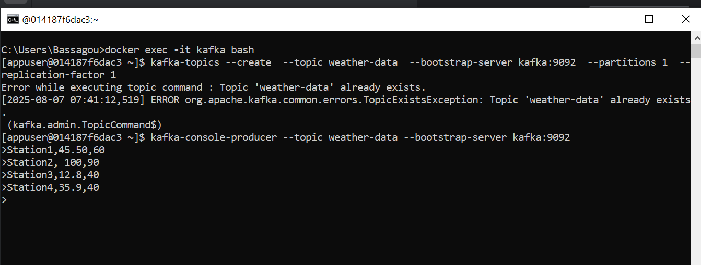
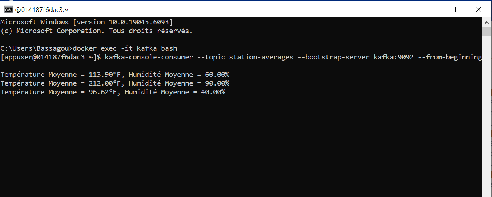
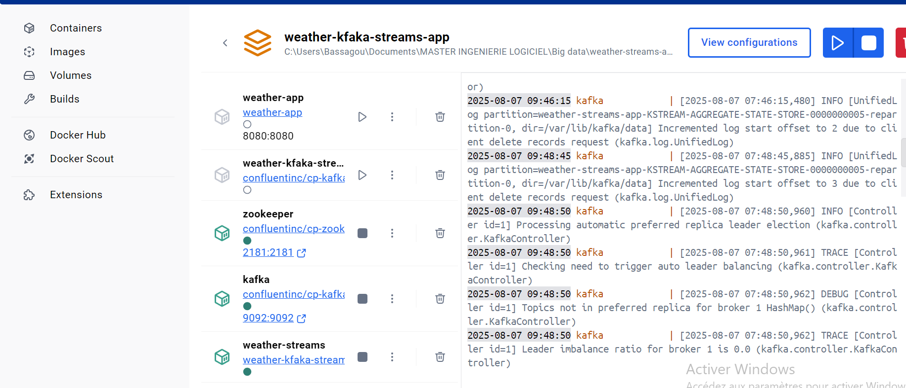
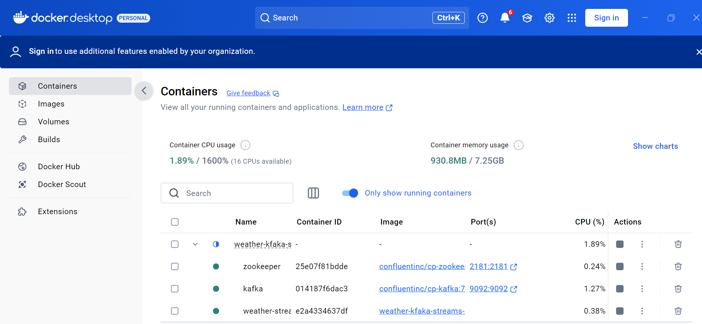

<h1>Projet</h1>
Création d'une application Kafka Streams pour effectuer les transformations suivantes : 
1. Lire les données météorologiques : Lisez les messages depuis le topic Kafka 'weather-data' 
en utilisant un flux (KStream). 
2. Filtrer les données de température élevée - Ne conservez que les relevés où la température est supérieure à 30°C. - Exemple : 
     - Input : Station1,25.3,60 | Station2,35.0,50 
      - Output : Station2,35.0,50 
3. Convertir les températures en Fahrenheit
     - Convertir les températures mesurées en degrés Celsius (°C) en Fahrenheit (°F) avec la 
formule : 
  Fahrenheit = (Celsius * 9/5) + 32 - Exemple : 
     - Input : Station2,35.0,50 
     - Output : Station2,95.0,50 
4. Grouper les données par station - Regroupez les relevés par station (station). 
      - Calculez la température moyenne et le taux d'humidité moyen pour chaque station. 
      - Exemple :  Big Data Processing 2024 - Input : Station2,95.0,50 | Station2,98.6,40 - Output : Station2,96.8,45 
5. Écrire les résultats 
Publiez les résultats agrégés dans un nouveau topic Kafka nommé 'station-averages'. 
Contraintes - Utilisez les concepts de KStream, KTable, et KGroupedStream. 
  - Gérer les données en assurant une sérialisation correcte. 
  - Assurer un arrêt propre de l'application en ajoutant un hook. 
Objectif
Resultat attendut
 application Kafka Streams doit : 
1. Lire les données météo depuis le topic 'weather-data'. 
2. Filtrer et transformer les relevés météorologiques. 
3. Publier les moyennes de température et d'humidité par station dans le topic 'station
averages'. 
Exemple de Résultat 
Données dans le topic weather-data : 
Station1,25.3,60 
Station2,35.0,50 
Station2,40.0,45 
Station1,32.0,70 
Données publiées dans le topic station-averages : 
Station2 : Température Moyenne = 37.5°F, Humidité Moyenne = 47.5% 
Station1 : Température Moyenne = 31.65°F, Humidité Moyenne = 65% 

<h1>Resultat</h1>

